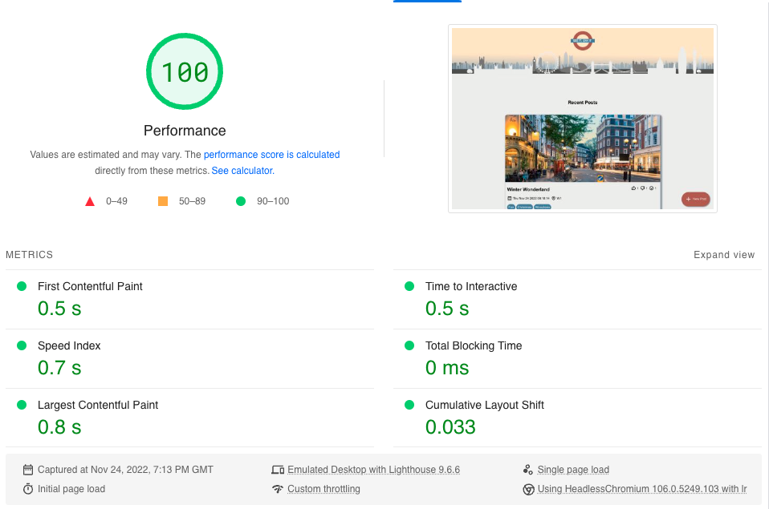

# See it, Say it API

:guard::guard::guard:

A London based community blogging website where people can view and create blog posts about all things London!

This repo contains the HTML, CSS and JavaScript files for the website.

## Motivation

This project is part of the futureproof curriculum for LAP 1 project. We were tasked with the creation of a journals website. Our theme of a London blogging website was chosen as all collaborators are London based. We were also excited by the idea of a community of bloggers sharing unique finds and awesome attractions in the city.

## Installation and Usage

Note: You can find the repository for the connected API [here](https://github.com/liambrockpy/SISI-api).

### Installation

- Clone or download the repo.
- Make sure the [Live Server](https://marketplace.visualstudio.com/items?itemName=ritwickdey.LiveServer) extension is installed and enabled on VSCode.

### Usage

- (In VSCode): Right-click on `index.html` in the root directory and choose `Open with Live Server` to launch the website in your browser.

## Technologies

- Javascript
- HTML
- CSS
- Deployment: Netlify

## Process

- Started with half a day planning, experimenting with ideas on Figma and creating tasks in a Trello board.
- Split up tasks into backend and frontend:
  - Frontend was split up into the different webpages.
  - Backend was split between defining routes and creating service methods, with testing completed after.
- Once backend completed, all collaborated on frontend.
- Connected up frontend and backend
- Deployed website
- Went through site together to identify any changes/updates needed

## Challenges and Wins

### Challenges

#### Emojis

A challenge encountered was that user should be able to click emojis and data persist through navigation between pages, and successfully update the server​. We wanted functionality in which each emoji could only be selected once​.

To achieve the above, we had to create an object containing each emoji with values set to false.

```
let emojiToggles = {
    like: false,
    dislike: false,
    surprise: false,
};
```

This object was then saved in local storage for access on multiple pages. Upon clicking an emoji, the respective value in the object is set to true so we could check if an emoji had been clicked. If true, no request would be made so the count remains the same. If false, the appropriate data was sent to the backend so the count could be incremented by 1.​

We managed to get the emoji count to persist throughout navigation. It took some time to decide how we were to implement the emoji functionality and how complicated we wanted it to be, so there may have been some time wasted going back and forth. With more time, we would like to include the functionality where a dislike emoji cannot be selected when a like emoji is already selected, and vice versa.

#### GitHub :face_with_spiral_eyes:

As all relatively new users of GitHub, we inevitability encountered some problems!

We wanted to update the file structure of our project mid way through in order to tidy up the codebase, but were getting lots of conflicts that were taking time​ to resolve one by one.

As a group we helped each other resolve conflicts, ensuring that no important changes were deleted. We each updated our file structure locally and pushed to a new branch on GitHub​

Our file structures were synced (finally). In future we would have an initial file structure pushed to GitHub and have the rest of the team clone the repo before starting any development.

### Wins

We successfully met the project requirements for an MVP and produced a stylish final product on time. We ensured we stayed on focus and on task through regular communication. This was also helped by the initial planning stage, enabling us to define a solid foundation of an idea before we started any coding.

We also tested our main home page on Google's PageSpeed Insights and found excellent results for performance on load.



## Future Features

### Map feature

We would like to add a map either onto the home page or as a separate page which adds the location each post is tagged to as a pin.
You would then be able to navigate around the map and select a post based on its location.

### Add own image to post

Currently a random image will be chosen and generated for the posts.
Would like to implement the ability for post creators to upload their own image with their post

### Deselect emoji

Would have liked to give the option to deselect an emoji.
Also not being able to select the dislike emoji when the like emoji has been selected would be a good feature.

### Homepage filters

Being able to filter the homepage by different criteria such as:

- Date
- Emoji count
- Labels

## Contributors

@adamminchella :man_technologist:
@liambrockpy :man_technologist:
@PollyFenne :woman_technologist:
@rnba12 :man_technologist:
